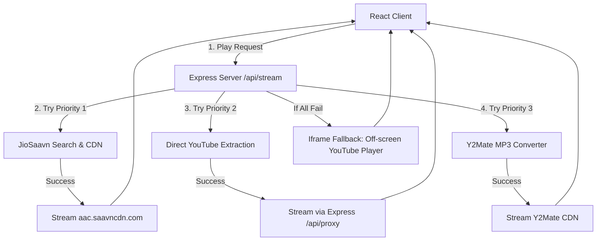

# 🎵 TuneWave

<p align="center">
  
</p>

<p align="center">
  <strong>A premium, Spotify-inspired web application for high-fidelity music streaming.</strong>
  <br />
  Bypasses corporate firewalls and YouTube rate limits by utilizing a smart multi-tier fallback pipeline combining <strong>JioSaavn CDN</strong>, <strong>YouTube scraping</strong>, and <strong>Y2Mate converters</strong>.
</p>

<p align="center">
  
  
  
  
  
</p>

---

## ✨ Features

- **🎨 Spotify-like Aesthetics:** A stunning dark-mode interface utilizing glassmorphism, responsive grids, and clean visual typography.
- **🛡️ Bulletproof Playback Engine:** Bypasses firewall restrictions and server IP rate blocks by utilizing a 4-tier fallback flow.
- **⚡ JioSaavn CDN Integration:** Stream high-quality audio files (`320kbps` / `160kbps`) directly from JioSaavn's CDN (`aac.saavncdn.com`) with zero CORS restrictions.
- **🔥 Y2Mate Conversion Fallback:** Automatically requests and resolves MP3 audio links directly from conversion endpoints on the server.
- **💾 Local State Persistence:** Fully persisted queues, volume levels, playlists, and liked songs via Zustand's middleware.
- **🎛️ Media Session API:** Fully compatible with mobile lock screen controls and desktop media buttons.
- **🔍 Debounced search:** Seamless search queries with mock fallbacks in case of backend disconnection.

---

## 🏗️ Streaming Architecture

TuneWave resolves audio streams through a strict sequence priority. This ensures instant playback in strict network environments (such as offices) while maintaining a massive library database.



---

## 🛠️ Technology Stack

### Frontend
- **Framework:** React 19 + TypeScript.
- **Build Tool:** Vite 6.
- **Styling:** Tailwind CSS v4 featuring glassmorphism utilities and variables (`tunewave-accent`, `tunewave-surface`).
- **State:** Zustand (with localStorage persistence).
- **Icons:** Lucide React.
- **Animations:** CSS Keyframes & Framer Motion.

### Backend
- **Server:** Node.js + Express.
- **Scraping/API:** `yt-dlp` CLI (with browser-profile safety detection), `ytmusic-api` package, and custom JSON scrapers.

---

## 🚀 Setup & Installation

### Prerequisites
- **Node.js** v18+ installed.
- (Optional) Exported `cookies.txt` in Netscape format in the root folder to prevent YouTube rate-limiting.

### 1. Project Installation
Clone the repository and install all dependencies:
```bash
npm install
```

### 2. Configure Environment Variables
Create a `.env` file in the root directory:
```env
VITE_API_URL=http://localhost:5000
```

### 3. Run Development Servers
Start both the Vite development server (frontend) and the Express server (backend):
```bash
# Start frontend (port 3000)
npm run dev

# Start backend (port 5000)
npm run start
```

---

## ☁️ Deployment

### Backend (Render / Heroku)
The project comes pre-configured with a `render.yaml` template for Render:
- **Build Command:** `npm install && npm run build`
- **Start Command:** `npm start`
- **Port:** `5000`

### Frontend (Vercel / Netlify)
Deploy as a static Single Page Application (SPA):
- **Framework Preset:** Vite
- **Build Command:** `npm run build`
- **Output Directory:** `dist`
- **Environment Variables:** Set `VITE_API_URL` to your backend's deployed URL.

---

## 🔮 Future Roadmap
- **Lyrics Sync:** Integration with third-party lyrics providers.
- **Drag & Drop Queue:** Enable manual queue reordering inside the desktop player.
- **P2P Listening Rooms:** Real-time synchronized listening sessions utilizing WebRTC.
